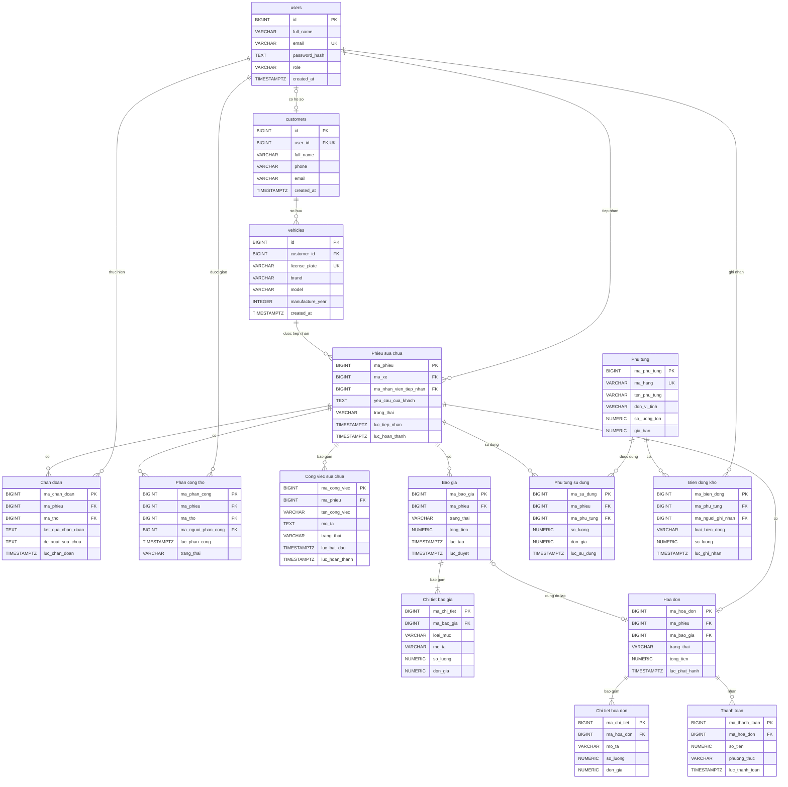

```mermaid
erDiagram
    users |o--o| customers : "co ho so"
    customers ||--o{ vehicles : "so huu"
    vehicles ||--o{ "Phieu sua chua" : "duoc tiep nhan"
    users ||--o{ "Phieu sua chua" : "tiep nhan"

    "Phieu sua chua" ||--o{ "Chan doan" : "co"
    users ||--o{ "Chan doan" : "thuc hien"
    "Phieu sua chua" ||--o{ "Phan cong tho" : "co"
    users ||--o{ "Phan cong tho" : "duoc giao"
    "Phieu sua chua" ||--o{ "Cong viec sua chua" : "bao gom"

    "Phieu sua chua" ||--o{ "Bao gia" : "co"
    "Bao gia" ||--|{ "Chi tiet bao gia" : "bao gom"
    "Bao gia" |o--o| "Hoa don" : "dung de lap"
    "Phieu sua chua" ||--o| "Hoa don" : "co"
    "Hoa don" ||--|{ "Chi tiet hoa don" : "bao gom"
    "Hoa don" ||--o{ "Thanh toan" : "nhan"

    "Phieu sua chua" ||--o{ "Phu tung su dung" : "su dung"
    "Phu tung" ||--o{ "Phu tung su dung" : "duoc dung"
    "Phu tung" ||--o{ "Bien dong kho" : "co"
    users ||--o{ "Bien dong kho" : "ghi nhan"

    users {
        BIGINT id PK
        VARCHAR full_name
        VARCHAR email UK
        TEXT password_hash
        VARCHAR role
        TIMESTAMPTZ created_at
    }

    customers {
        BIGINT id PK
        BIGINT user_id FK, UK
        VARCHAR full_name
        VARCHAR phone
        VARCHAR email
        TIMESTAMPTZ created_at
    }

    vehicles {
        BIGINT id PK
        BIGINT customer_id FK
        VARCHAR license_plate UK
        VARCHAR brand
        VARCHAR model
        INTEGER manufacture_year
        TIMESTAMPTZ created_at
    }

    "Phieu sua chua" {
        BIGINT ma_phieu PK
        BIGINT ma_xe FK
        BIGINT ma_nhan_vien_tiep_nhan FK
        TEXT yeu_cau_cua_khach
        VARCHAR trang_thai
        TIMESTAMPTZ luc_tiep_nhan
        TIMESTAMPTZ luc_hoan_thanh
    }

    "Chan doan" {
        BIGINT ma_chan_doan PK
        BIGINT ma_phieu FK
        BIGINT ma_tho FK
        TEXT ket_qua_chan_doan
        TEXT de_xuat_sua_chua
        TIMESTAMPTZ luc_chan_doan
    }

    "Phan cong tho" {
        BIGINT ma_phan_cong PK
        BIGINT ma_phieu FK
        BIGINT ma_tho FK
        BIGINT ma_nguoi_phan_cong FK
        TIMESTAMPTZ luc_phan_cong
        VARCHAR trang_thai
    }

    "Cong viec sua chua" {
        BIGINT ma_cong_viec PK
        BIGINT ma_phieu FK
        VARCHAR ten_cong_viec
        TEXT mo_ta
        VARCHAR trang_thai
        TIMESTAMPTZ luc_bat_dau
        TIMESTAMPTZ luc_hoan_thanh
    }

    "Bao gia" {
        BIGINT ma_bao_gia PK
        BIGINT ma_phieu FK
        VARCHAR trang_thai
        NUMERIC tong_tien
        TIMESTAMPTZ luc_tao
        TIMESTAMPTZ luc_duyet
    }

    "Chi tiet bao gia" {
        BIGINT ma_chi_tiet PK
        BIGINT ma_bao_gia FK
        VARCHAR loai_muc
        VARCHAR mo_ta
        NUMERIC so_luong
        NUMERIC don_gia
    }

    "Phu tung" {
        BIGINT ma_phu_tung PK
        VARCHAR ma_hang UK
        VARCHAR ten_phu_tung
        VARCHAR don_vi_tinh
        NUMERIC so_luong_ton
        NUMERIC gia_ban
    }

    "Phu tung su dung" {
        BIGINT ma_su_dung PK
        BIGINT ma_phieu FK
        BIGINT ma_phu_tung FK
        NUMERIC so_luong
        NUMERIC don_gia
        TIMESTAMPTZ luc_su_dung
    }

    "Bien dong kho" {
        BIGINT ma_bien_dong PK
        BIGINT ma_phu_tung FK
        BIGINT ma_nguoi_ghi_nhan FK
        VARCHAR loai_bien_dong
        NUMERIC so_luong
        TIMESTAMPTZ luc_ghi_nhan
    }

    "Hoa don" {
        BIGINT ma_hoa_don PK
        BIGINT ma_phieu FK
        BIGINT ma_bao_gia FK
        VARCHAR trang_thai
        NUMERIC tong_tien
        TIMESTAMPTZ luc_phat_hanh
    }

    "Chi tiet hoa don" {
        BIGINT ma_chi_tiet PK
        BIGINT ma_hoa_don FK
        VARCHAR mo_ta
        NUMERIC so_luong
        NUMERIC don_gia
    }

    "Thanh toan" {
        BIGINT ma_thanh_toan PK
        BIGINT ma_hoa_don FK
        NUMERIC so_tien
        VARCHAR phuong_thuc
        TIMESTAMPTZ luc_thanh_toan
    }
```